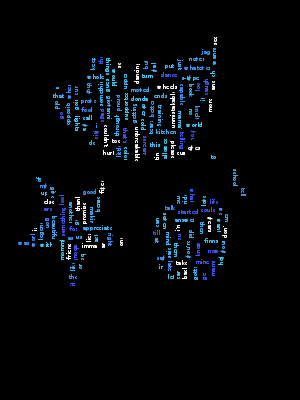

<h1 align="center">
   
 Frequency List for Reading Song Lyrics
   
</h1>

<h4 align="center">A simple application that reads text and parses based on frequency of the word
  
    
  
  
'
 

  

Key Features
 

* Reads in a non-empty text file
   
* Outputs a text file containg the frequency of the words
   
* Outputs a word cloud png image 

  

How to use
 

* Open program using eclipse IDE for best results*
   
* Main Java file found in directory path countwords/src/main/java/com/countwords/
   
* Create a text file labled "lyrics.txt" and paste the lyrics to the song
   
  you would like to find the frequency of each word
   
* find a png image you would like to turn into a wordcloud image and rename to "whale.png" for simplicity
   
* run the program
   
* A file labled frequencyList.txt should have been created in your directory containing the word and count
   
* A png image lable test.png should have been created demonstrating the words in a wordcloud format
    (words take up non white space)
    
   
 
 <h2> Project Details </h2>
 
 
  The Data Structure used to to calculate the word frequencies was a HashMap which used the word as the key value
      and the count as the value stored. For each word inserted if the word existed within the map the value was incremented
      by '1' if the word did not exist the word was added to the map and its value was set to 1. The data structures offers   
      quick insertion and find of a specific value based on the key value pairs. 
  

  
    
  
  
  The song chosen was Kanye West "Hey Mama" from his 2005 Album labled "Late Registration" which won a few awards      
       between the years of 2005-2006 some include Billboard R&B/Hip-Hop Awards "Top Rap Album" and Hungarian Music Awards   
       "Best Foreign Rap or Hip-Hop Album of the Year". The song "Hey Mama", dedicated to his mother Donda West who passed
       in 2007 due to complications from surgery, was Kanye West only pillar of support at the time. To no surprise aside 
       from common stop words the word "mama" was the word that appeared the most 11 times throughout the song.
  

 
 
 

<h3>Credits</h3>

  credits to <a href= "https://github.com/kennycason/kumo">Kenny Cason </a> for the wordcloud API
  Kanye West - "Hey Mama"

  
  
  
  
 

    

